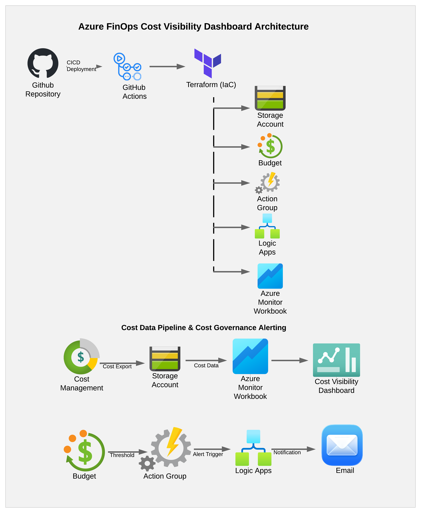

# Azure FinOps Cost Visibility Dashboard

## Overview
This project provides an Azure-native cost visibility and governance solution using Azure Cost Management, Azure Monitor Workbooks, and Logic Apps. It is fully deployed using Terraform and automated via GitHub Actions.

## Architecture

This architecture demonstrates cost data ingestion, visualization, governance, and automated alerting, fully provisioned using Terraform and deployed via GitHub Actions.
## Objective
Build an Azure-native FinOps cost visibility dashboard that exports cost data, visualizes spend, triggers budget alerts, and automates notifications, all deployed with Terraform and managed in GitHub.

## MVP Scope
- Azure Resource Group
- Azure Storage Account
- Azure Cost Management Export
- Azure Budget
- Azure Monitor Action Group
- Azure Logic App for notifications
- Azure Monitor Workbook

## Key Features
- Cost data export to Azure Storage
- Cost visualization via Azure Monitor Workbooks
- Budget monitoring and alerting
- Automated notifications using Logic Apps
- Infrastructure as Code using Terraform
- CI/CD using GitHub Actions
